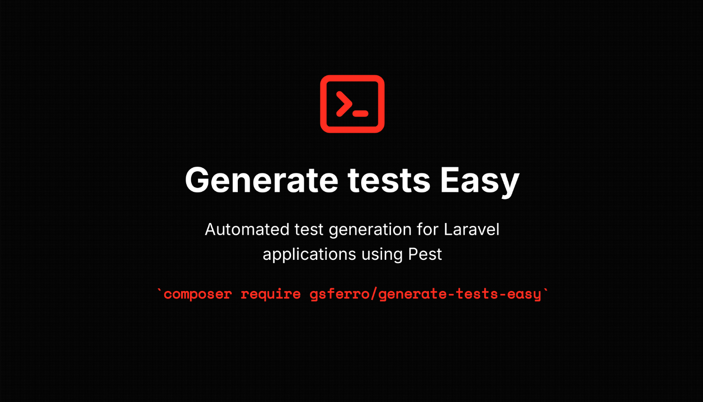

<div align="center">
    
    <br>
    <a href="https://packagist.org/packages/gsferro/generate-tests-easy"></a>
    <a href="https://packagist.org/packages/gsferro/generate-tests-easy"></a>
    <a href="https://packagist.org/packages/gsferro/generate-tests-easy"></a>
</div>

------

A Laravel package for automatically generating comprehensive Pest tests for your application based on code analysis.

## Description

Generate Tests Easy is a powerful tool that analyzes your Laravel application's models, controllers, and database structure to automatically generate comprehensive test suites using Pest PHP. It can detect relationships, scopes, validation rules, and other features to create relevant tests that ensure your application works as expected.

## Features

- Automatically generates Pest tests for models, controllers, and other components
- Analyzes database structure to create appropriate tests
- Detects and tests model relationships, scopes, and validation rules
- Supports API controllers with specialized API test generation
- Installs and configures Pest if not already present
- Configures Pest Arch presets for PHP, security, and Laravel
- Supports Livewire components (if detected in your project)
- Supports Filament resources and panels (if detected in your project)
- Works with both new and existing projects

## Requirements

Package | Version
--------|----------
PHP | ^8.0\|^8.1\|^8.2\|^8.3\|^8.4
Laravel | ^8.0\|^9.0\|^10.0\|^11.0\|^12.0
Pest PHP | ^1.22\|^2.8.1\|^3.0
Pest Plugin Laravel | ^1.4\|^2.0\|^3.2
Pest Plugin Arch | ^2.0\|^v3.0
PHPUnit | ^9.5.10\|^10.1\|^11.0\|^12.0
Symfony Finder | ^5.0\|^6.0\|^7.0

## Installation

```bash
composer require gsferro/generate-tests-easy --dev
```

## Usage

### Basic Usage

To generate tests for all models and controllers in your application:

```bash
php artisan generate-tests:all
```

### Generate Tests for Specific Components

```bash
# Generate tests for a specific model
php artisan generate-tests:model User

# Generate tests for a specific controller
php artisan generate-tests:controller UserController

# Generate tests for models based on database tables
php artisan generate-tests:database

# Generate tests for Filament resources
php artisan generate-tests:filament PatientResource

# Generate tests for all Filament resources
php artisan generate-tests:filament --all
```

### Options

All commands support the following options:

- `--force`: Overwrite existing tests
- `--verbose`: Show detailed information during generation

## Types of Tests Generated

### Filament Resource Structure

When working with Filament resources, the package recognizes the standard Filament resource structure:

```
PatientResource.php
PatientResource/
  ├── Pages/
  │   ├── CreatePatient.php
  │   ├── EditPatient.php
  │   ├── ListPatients.php
  │   └── ViewPatient.php
```

The package will generate appropriate tests for each component of the resource:
- A test for the main resource class (PatientResource)
- Tests for each page class (ListPatients, CreatePatient, EditPatient, ViewPatient)

Each test is tailored to the specific functionality of the component, ensuring comprehensive test coverage. For example, ViewPatient tests will verify that:
- The page can be rendered successfully
- The page displays the correct record data
- Relationships are properly displayed
- The edit button works correctly

### Model Tests

- **Basic Model Tests**: Tests model attributes, inheritance, and traits
- **Relationship Tests**: Tests each relationship defined in the model
- **Scope Tests**: Tests each scope method defined in the model
- **Validation Tests**: Tests validation rules defined in the model
- **Factory Tests**: Tests model factory if available

### Controller Tests

- **Unit Tests**: Tests controller methods, routes, and configuration
- **Feature Tests**: Tests HTTP requests to controller endpoints
- **API Tests**: Tests API endpoints for API controllers

### Livewire Tests (if Livewire is installed)

- **Component Tests**: Tests Livewire component rendering and functionality
- **Event Tests**: Tests Livewire events and listeners

### Filament Tests (if Filament is installed)

- **Resource Tests**: Tests Filament resource configuration, model association, and navigation
- **List Page Tests**: Tests the resource list page, table columns, search, and sorting functionality
- **Create Page Tests**: Tests the resource create page, form fields, validation, and record creation
- **Edit Page Tests**: Tests the resource edit page, form fields, validation, and record updates
- **Form Tests**: Tests form components, validation rules, and data submission
- **Table Tests**: Tests table columns, filters, actions, and bulk actions
- **Panel Tests**: Tests Filament panel configuration and access

## Configuration

Publish the configuration file:

```bash
php artisan vendor:publish --tag=generate-tests-easy-config
```

### Configuration Options

```php
return [
    // Path where tests will be generated
    'test_path' => 'tests',

    // Whether to install Pest if not already installed
    'install_pest' => true,

    // Whether to configure Pest Arch presets
    'configure_arch_presets' => true,

    // Test coverage target percentage
    'coverage_target' => 80,

    // Custom stubs path (if you want to customize the test templates)
    'stubs_path' => null,
];
```

## Extending

You can extend the package by:

1. Publishing and customizing the test stubs
2. Creating custom analyzers for specific components
3. Adding custom test generators

## Contributing

Contributions are welcome! Please feel free to submit a Pull Request.

## License

This package is open-sourced software licensed under the [MIT license](LICENSE).

## Running Package Tests

This package comes with its own test suite to ensure functionality works as expected. To run the tests:

```bash
# Run all tests
composer test

# Run tests with coverage report
composer test:coverage

# Run only unit tests
composer test:unit

# Run only feature tests
composer test:feature

# Run architecture tests
composer test:arch
```

These commands are defined in the `composer.json` file and use Pest PHP for testing. The test suite includes unit tests, feature tests, and architecture tests to ensure the package works correctly.
